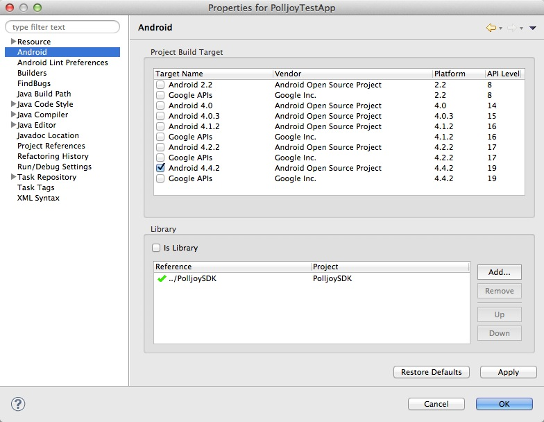

> In-app polls made easy. Integrate in 2 lines of code.

#Polljoy Android Integration Guide

Welcome friend! This guide will get you started with polljoy, fast & easy.

Got questions?  Email us at help@polljoy.com

-
<b>Simple</b> - polljoy is designed to be simple for users and especially developers. Just 2 API calls, you can get your polls running.

<b>Open</b> - The polljoy API is open. The SDK comes with all source code and a test app. You can simply install the SDK as-is to integrate the polljoy service.

<b>Easy</b> - polljoy is easy to use. Check out the test App in the SDK. Test with your own user id and app id. You can see how polljoy works. 

<b>Flexible</b> - the polljoy SDK comes with the required UI to present the poll and do all the tasks for you. But if you want to implement your own UI, you can. The poll data is open. Enjoy!


# The polljoy Admin Console
You can setup and manage all your polls through a web interface here https://admin.polljoy.com

Note: Please note - PollJoy requires Android SDK level 8 (Android 2.2) or later.  

# Setup your Android Project

1.	Copy Polljoy SDK Archived File to your project workspace folder and unzip, you will see two projects there: PolljoySDK and PolljoyTestApp.
2.	In eclipse, import PolljoySDK project into your workspace.
3.	Add PolljoySDK project as a required project on the build path for your own project.

  

4. Add INTERNET permission to your project’s AndroidManifest.xml:

 ``` java
 <uses-permission android:name="android.permission.INTERNET" />
 ```
 
5.	Again in `AndroidManifest.xml`, declare `PJPollViewActivity` by adding the following lines between `<application>` and `</application>`:

 ``` java
 <activity
 android:name="com.polljoy.PJPollViewActivity"
 android:launchMode="singleInstance"
 android:theme="@android:style/Theme.Translucent" >
 </activity>
 ```


### Implement polljoy in Project

 Import Polljoy package by adding the following code when you call methods within PolljoySDK:
 
 ``` java
 import com.polljoy.Polljoy;
 ``` 

 polljoy works in the background to avoid interruption to your app's main thread.
 
 polljoy requires each app to register a session and obtain the **Session ID** for all communications to the API. To have best performance and integration, we recommend registering the session at application startup. You'll need your **App ID** (they are available in the web [admin panel](https://admin.polljoy.com)
 
 To register a session:
 
 Upon application startup, call Polljoy to register session with `ApplicationContext` and your **App ID**. You can either add the lines in your custom Application class or your LAUNCHER activity.
 
 i.	If you add it In your launcher activity: 

 ``` java
 // ...
	protected void onCreate(Bundle savedInstanceState) {
		super.onCreate(savedInstanceState);
		Polljoy.startSession(this.getApplicationContext(), " YOUR_APP_ID");
 // ...
 ```

 ii.	Or if you add it In your custom Application class,
 
 ``` java
 // ...
	public void onCreate() {
		super.onCreate();
		Polljoy.startSession(this, "YOUR_APP_ID");
 // ...
 ```
 
 PollJoy SDK will automatically handle all session control and all required information to get the correct poll based on your poll setup in admin panel and save your poll result for analysis. These includes the session ID, session count, time (days) since first call PollJoy SDK, device ID, platform, OS version ... etc. 

 Each time you call `startSession`, SDK will increase the session count by 1. So, you should only call it once for each app launch to get the session count correct.
 
 Once the session is registered, SDK will cache all app settings including the default image (if any) that you have setup in the [admin panel](https://admin.polljoy.com). After caching, there will be no operation until you request polls from PollJoy service.
 

### Get polls

After you started the session, you can get polls at any time and place you want!

In your program logic, import `com.polljoy.Polljoy; ` at the program you want to get polls. Then call:

 ``` java
 // ...
   Polljoy.getPoll(appVersion, 
   		   level, 
   		   userType,
   		   delegate);
 // ...
 ```
  
In summary:

`appVersion`: your app's version to be used as a poll selection criteria. This should match with your poll setting. Or set it as nil if you are not using.

`level`: if your app is a game app, this is your game level. This should match with your poll setting. Or set it as 0 if you are not using.

`userType`: your app user type either **Pay** or **Non-Pay**. This is the `ENUM PJUserType` as defined in `Polljoy.java`

`delegate`: the instance to handle all callbacks from polljoy SDK. The delegate should implement `PolljoyDelegate` as defined in `Polljoy.java`

Please check `Polljoy.java` for the type of the parameters. polljoy's API is open. All data returned is passed back to the delegate. Delegate can use the returned poll data for their own control if needed.

`NOTE: if you don't use any poll selection criteria, you can simply call the following method and let the SDK handle everything.

  ``` java
  // if you DON'T need to handle callbacks from Polljoy
  // this will auto show the polls when all polls are ready
      Polljoy.getPoll();
  // ...
  ```
  
### Handle callbacks from SDK

polljoy will inform delegate at different stages when polls are downloaded, ready to show, user responded etc. App can optionally implement the delegate methods to control the app logic. The delegate methods are:

 ``` java
 void PJPollNotAvailable(PJResponseStatus status);
 ```
 
When there is no poll match with your selection criteria or no more polls to show in the current session. 

 ``` java
 void PJPollIsReady(ArrayList<PJPoll> polls);
 ```
 
After you request for poll and poll/s is/are ready to show (including all defined images are downloaded). Friendly tip - If you are displaying the poll in the middle of an active game or app session that needs real time control, consider to pause your app before presenting the poll UI as needed. 

polls array returned are all the matched polls for the request. Please refer `PJPoll.java` for the data structure.
When you're ready to present the poll, call:

 ``` java
 Polljoy.showPoll();
 ```

This will present the polljoy UI according to your app color and poll settings. Then polljoy SDK will handle all the remaining tasks for you. These include handling the user's response, informing delegate for any virtual amount user received, upload result to polljoy service... etc.

We highly recommend you implement this delegate method so that you know polls are ready and call polljoy SDK to show the poll or do whatever control you need.

 ``` java
 void PJPollWillShow(PJPoll poll);
 ```
 
The polljoy poll UI is ready and will show. You can do whatever UI control as needed. Or simply ignore this implementation.

 ``` java
 void PJPollDidShow:(PJPoll poll);
 ```
 
The polljoy poll UI is ready and has shown. You can do whatever UI control as needed. Or simply ignore this implementation.

 ``` java
 void PJPollWillDismiss:(PJPoll poll);
 ```
 
The polljoy poll UI is finished and will dismiss. You can do whatever UI control as needed. Or simply ignore this implementation. You can prepare your own UI before resuming your app before the polljoy poll UI is dismissed.

 ``` java
 void PJPollDidDismiss(PJPoll poll);
 ```
 
The polljoy poll UI is finished and has dismissed. You can do whatever UI control as needed. Or simply ignore this implementation. You can prepare your own UI to resume your app before the polljoy UI is dismissed. This is the last callback from polljoy and all polls are completed. You should resume your app if you have paused.

 ``` java
 void PJPollDidResponded(PJPoll poll);
 ```
 
User has responded to the poll. The poll will contain all the poll data including user's responses. You can ignore this (the results are displayed in the polljoy.com admin console and able to be exported) or use it as you wish.
If you issue a virtual currency amount to user, you MUST implement this method to handle the virtual amount issued (especially if your app is game). This is the only callback from SDK that informs the app the virtual amount that the user collected.

 ``` java
 void PJPollDidSkipped(PJPoll poll);
 ```
 
 If the poll is not mandatory, user can choose to skip the poll. You can handle this case or simply ignore it safely.
 
-
#### Got questions? Email us at help@polljoy.com

## Version History

### Version 0.2
 - fix a bug that the poll doesn't show when both its app image and poll image are not set
 - support ',' in multiple choice answers
 - added tags as selection criteria (reserved for future use)
 - PJPoll structure updated

### Version 0.1
 - Initial beta release
